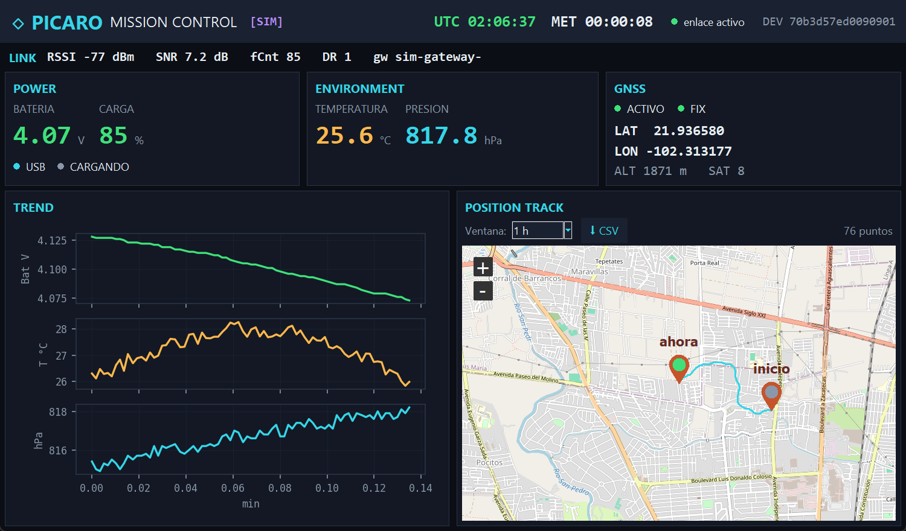

# 🛰️ Ejercicio 10 — PICARO Mission Control (dashboard tkinter → ChirpStack)

> **En una frase:** un **dashboard de escritorio** (Python + **tkinter**) estilo **control de misión de
> la NASA** que **consume la telemetría del [Ejercicio 09](../09_radiosonda_picaro_full/)** desde
> ChirpStack, la **guarda en SQLite** local y la muestra en paneles, gráficas de tendencia, un **mapa
> real con el track de posiciones** (filtro de tiempo) y un log de eventos, con **exportación a CSV**.
> **Plataforma:** Python 3.x en Windows/Linux/macOS. **Sin hardware:** trae **modo simulador**.

**Distribución:** arriba tres columnas **Power · Environment · GNSS**; en medio **Trend** y **Position
Track** a mitad de pantalla cada una; abajo el **log**. Junto al filtro de tiempo hay un botón **⬇ CSV**.

## 🎯 Qué vas a conseguir



Una consola con **fuentes claras y colores de alto contraste** (legibles con distinta luz): batería,
temperatura/presión, calidad de enlace (RSSI/SNR/fCnt), estado **GNSS** (activo/fix), **gráficas** de
tendencia y un **mapa real** con la trayectoria del dispositivo.

## 🧰 Antes de empezar
- [ ] **Python 3.x** (en Windows, el lanzador `py -3`). Incluye `tkinter` y `sqlite3`.
- [ ] Dependencias: `py -3 -m pip install -r requirements.txt` (paho-mqtt, matplotlib, tkintermapview).
- [ ] **Para datos en vivo (modo `mqtt`):** [ChirpStack](../00_chirpstack-docker/) corriendo, el
      **Ejercicio 09** dado de alta **con su codec `decoder.js`** (para que llegue el `object`
      decodificado), y la placa emitiendo con enlace. **Si no tienes eso**, usa el **modo `sim`**.

> El dashboard consume el **mismo `object`** que produce el codec del ej.09
> ([`../09_radiosonda_picaro_full/chirpstack/decoder.js`](../09_radiosonda_picaro_full/chirpstack/decoder.js)):
> `gps_active, gps_fix, latitude, longitude, altitude_m, satellites, battery_v, battery_pct, charging,
> usb_powered, temperature_c, pressure_hpa`.

## 🚀 Cómo se corre
```bash
# desde specs/exercises/10_dashboard-tkinter/
py -3 -m pip install -r requirements.txt
cp config.example.json config.json      # y edita app_id / dev_eui / broker si hace falta

py -3 dashboard.py --mode sim           # DEMO sin hardware (datos sintéticos, GPS en movimiento)
py -3 dashboard.py --mode mqtt          # EN VIVO desde ChirpStack (MQTT :1883)
py -3 dashboard.py --mode replay        # REPRODUCE lo ya guardado en la SQLite
```
Sin `--mode`, usa el `mode` de `config.json` (o `config.example.json`).

### Los 3 modos
| Modo | Fuente | Cuándo |
|---|---|---|
| **`sim`** | telemetría sintética (batería que baja, temp/presión suaves, **GPS que se mueve**) | probar/mostrar el dashboard **sin gateway ni placa** |
| **`mqtt`** | uplinks reales de ChirpStack (`application/<app>/device/+/event/up`) | operación normal con la placa emitiendo |
| **`replay`** | registros ya guardados en la SQLite | **reproducir** una sesión pasada |

## ⚙️ Configuración (`config.json`)
| Campo | Qué es |
|---|---|
| `mode` | `sim` · `mqtt` · `replay` |
| `mqtt.host` / `mqtt.port` | broker MQTT de ChirpStack (por defecto `localhost:1883`) |
| `app_id` | ID de tu Application en ChirpStack (para el topic MQTT) |
| `dev_eui` | vacío = todos los devices de la app; o un DevEUI concreto |
| `db_path` | ruta de la SQLite (`picaro_telemetry.db`) |
| `default_window` | ventana inicial del mapa/gráficas (`15 min · 1 h · 6 h · 24 h · Todo`) |
| `map_start` | centro/zoom inicial del mapa |

## 🗺️ Mapa, track y ventana de tiempo
El mapa (OpenStreetMap, vía `tkintermapview`) une con una **polilínea** los puntos **con fix** en orden
temporal, con marcadores de **inicio** y **posición actual**. El selector **Ventana** filtra por tiempo.

> **Ventana recomendada: 1 h** (~120 puntos a 30 s/uplink) — claro y fluido. Para evitar saturar, el
> track se **decima automáticamente** a **~500 puntos** máx. (p. ej. 24 h → 1 punto cada ~3 min),
> conservando siempre la posición actual. Así el mapa responde con cualquier ventana.

### ⬇ Exportar a CSV
El botón **⬇ CSV** (junto al selector de ventana) exporta a un archivo `.csv` **todos los registros de
la ventana de tiempo seleccionada** con **todos los campos capturados** (las 23 columnas de la tabla
`telemetry`, incluido `raw_json`). Útil para análisis en Excel/pandas.

## 🗃️ Base de datos (SQLite)
Cada uplink se guarda en la tabla `telemetry` (una "caja negra" del lado consumidor): `ts, iso,
dev_eui, f_cnt, f_port, rssi, snr, gateway_id, freq, dr` + los campos del `object`
(gps_active, gps_fix, lat, lon, alt, sats, battery_v/pct, charging, usb, temp_c, press_hpa) + `raw_json`.
Consúltala con cualquier herramienta SQLite o reprodúcela con `--mode replay`.

## 🎨 Look & Feel
Paleta de alto contraste (fondo casi negro, texto casi blanco, acentos verde/cian/ámbar/rojo) en
`theme.py`; el **estado nunca depende solo del color** (siempre hay texto/etiqueta). Fuentes: mono
(`Consolas`) para los valores, sans para etiquetas.

## 🛠️ Si algo falla
| Síntoma | Causa / arreglo |
|---|---|
| `ModuleNotFoundError` | `py -3 -m pip install -r requirements.txt` |
| Mapa en blanco/gris | `tkintermapview` descarga *tiles* por **internet** (luego los cachea). Revisa conexión. |
| `mqtt`: no llegan datos | ¿ChirpStack arriba? ¿`app_id` correcto? ¿la placa **con enlace**? Prueba `--mode sim`. |
| `object` vacío por MQTT | falta el **codec** en el device profile del ej.09 (súbelo, ver ej.09). |
| Se ve pequeño | la ventana es redimensionable; agranda o maximiza. |

## 🧪 Prueba rápida (headless)
`py -3 selftest.py` verifica la capa de datos (parser ChirpStack, SQLite, decimado, simulador) **sin GUI**.

## ➡️ Navegación
- ⬅️ Anterior: [Ejercicio 09 · Radiosonda PICARO Full](../09_radiosonda_picaro_full/)
- 🏠 [Índice de ejercicios](../README.md) · 📚 [Wiki](https://github.com/ovelazquezj/radiosonda_PIcaro/wiki)

## 📎 Referencia
```
dashboard.py     app principal (UI tkinter + loops)
theme.py         paleta, fuentes y estilos "control de misión"
storage.py       capa SQLite (esquema + consultas)
mqtt_ingest.py   ingesta MQTT + parser de eventos ChirpStack v4
replay.py        modo replay (desde SQLite) y simulador
config.example.json  copia a config.json y edita tus IDs
selftest.py      prueba headless de la capa de datos
```
Guía común: [ChirpStack API (REST · MQTT · codec)](../COMMON_CHIRPSTACK_API.md).

---
> 📄 Material educativo bajo **CC BY 4.0** © **Omar Velazquez** — ver [`LICENSE-CC-BY-4.0.md`](../../../LICENSE-CC-BY-4.0.md).
